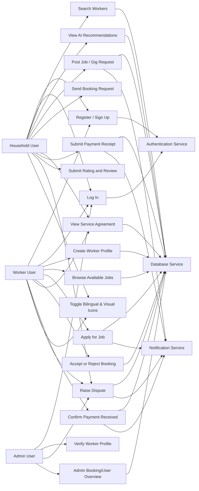
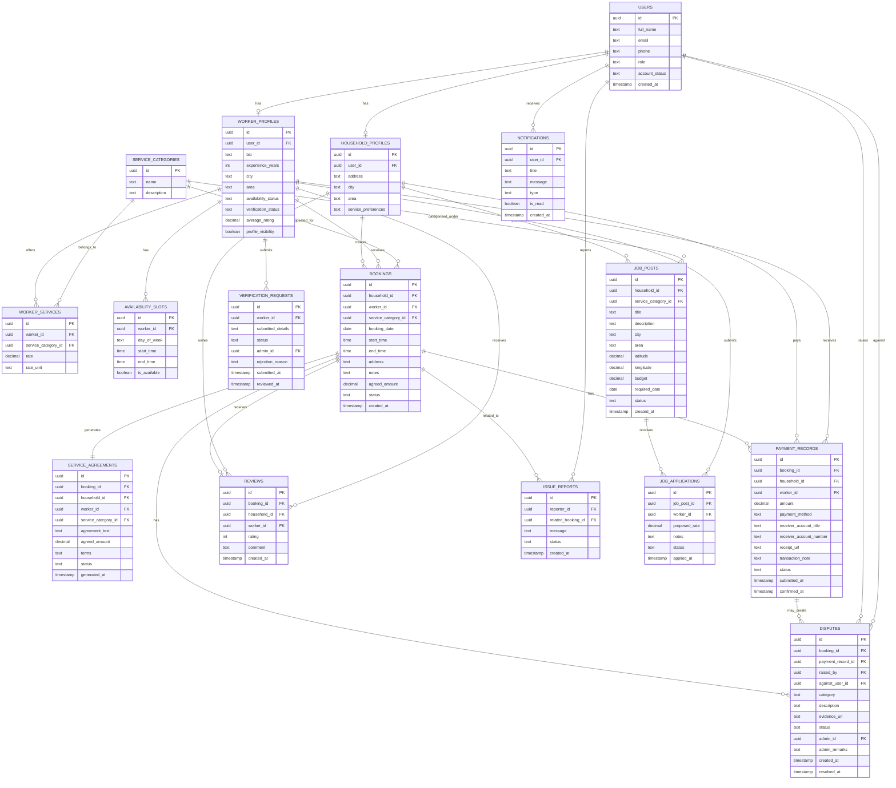
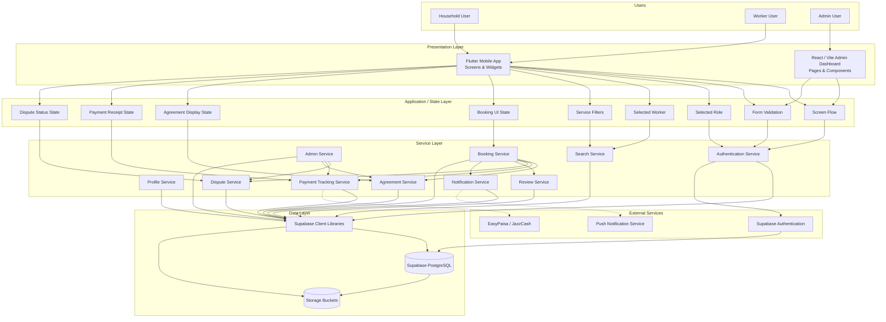
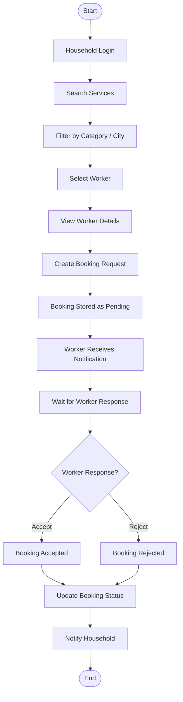
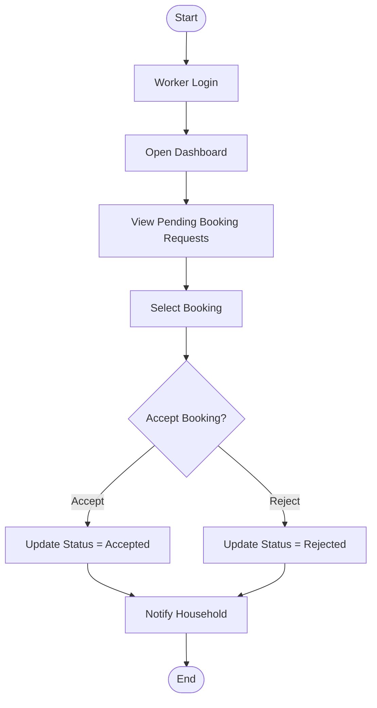
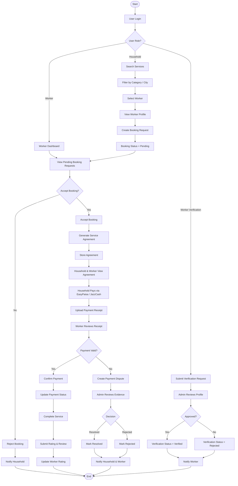
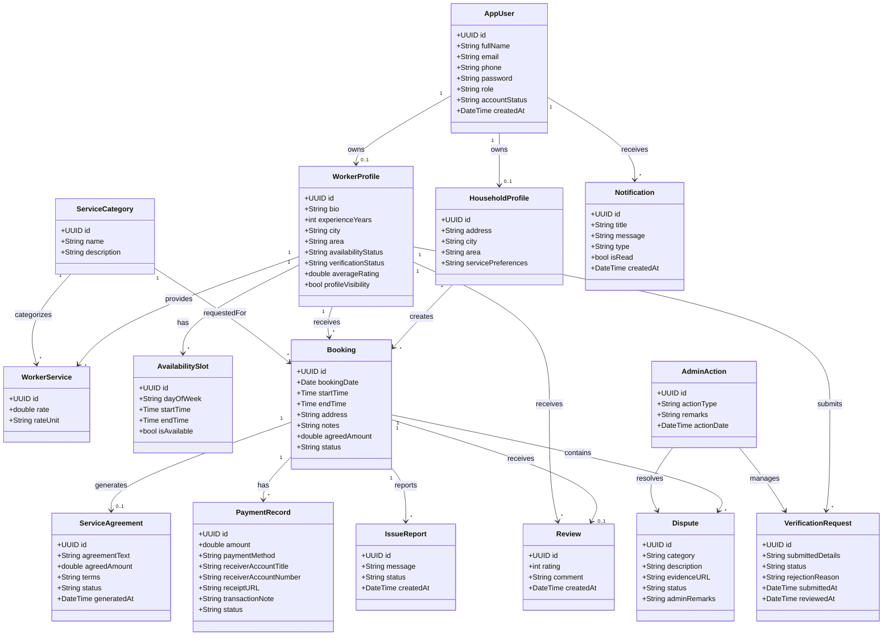
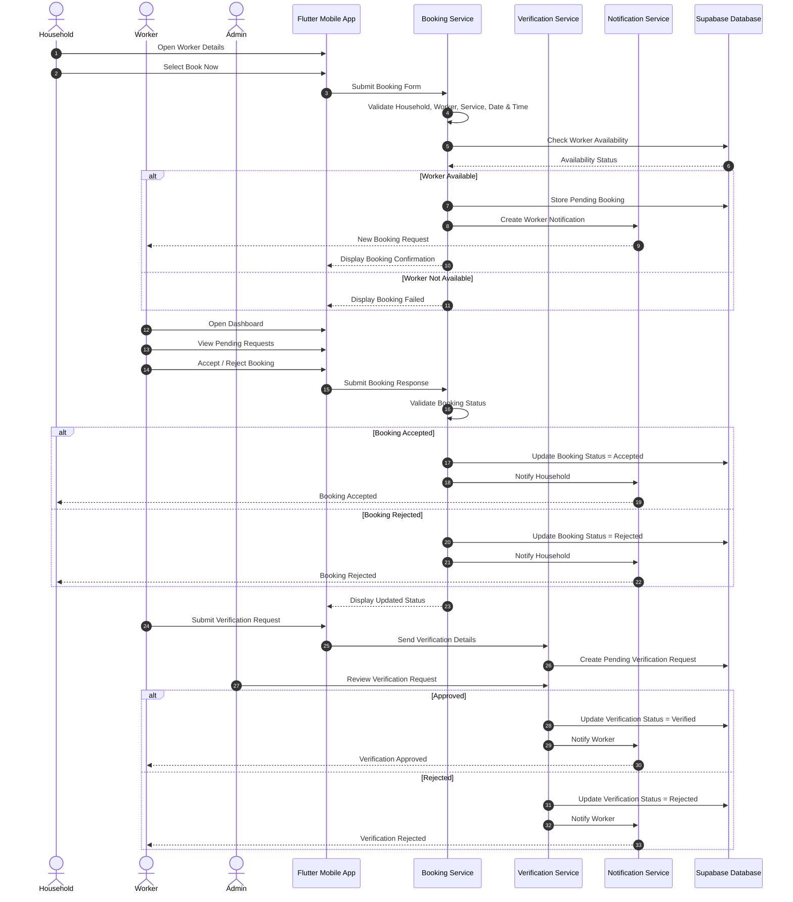
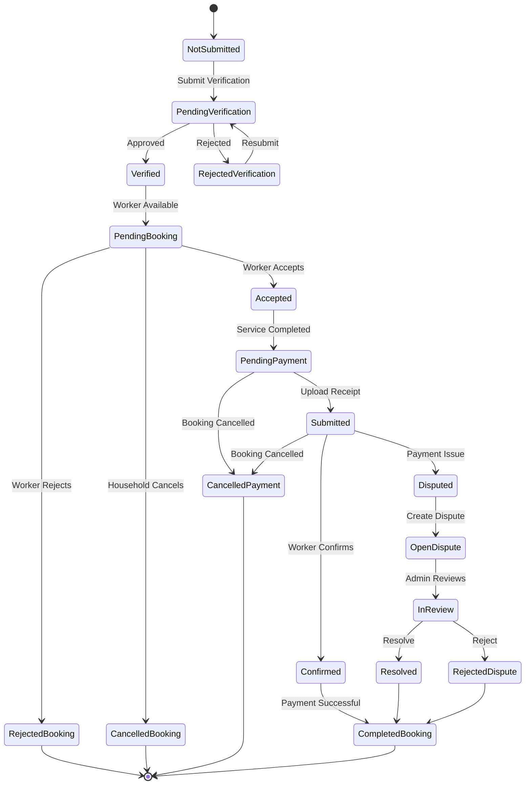

# Design Diagrams Summary

This document provides a detailed summary and breakdown of the **9 Design Diagrams** defined in the HomeEase project (`HomeEase_Diagram.drawio`). It includes the purpose, key elements, relationships, and embedded rendering code (using Mermaid syntax) for each diagram.

---

## 1. Use Case Diagram
* **Purpose:** Defines the boundary of the HomeEase system, the actors involved, and the specific operations (use cases) they can perform, along with the backend services they trigger.
* **Actors:** Household User, Worker User, Admin User.
* **Services:** Authentication Service, Database Service, Notification Service.
* **Key Relations:**
  - Household and Worker actors interact with Authentication (`UC1`, `UC2`).
  - Household initiates search (`UC5`) and bookings (`UC6`).
  - Worker accepts/rejects bookings (`UC7`).
  - Admin handles verifications (`UC4`) and disputes (`UC10`).

---

## 2. Entity Relationship Diagram (ERD)
* **Purpose:** Details the logical database structure, key constraints (PK/FK), and structural relationships between tables in the Supabase PostgreSQL database.
* **Key Entities & Relations:**
  - `USERS` has a 1-to-0..1 relationship with `HOUSEHOLD_PROFILES` and `WORKER_PROFILES`.
  - `WORKER_PROFILES` has many-to-many relationship with `SERVICE_CATEGORIES` through `WORKER_SERVICES`.
  - `BOOKINGS` acts as the central intersection table linking `HOUSEHOLD_PROFILES`, `WORKER_PROFILES`, and `SERVICE_CATEGORIES`.
  - A `BOOKING` generates exactly one `SERVICE_AGREEMENT`, and can have multiple `PAYMENT_RECORDS`, `REVIEWS`, and `DISPUTES`.

---

## 3. System Architecture Diagram
* **Purpose:** Represents the layered architecture of the application, delineating separation of concerns from user interaction down to persistent storage.
* **Layers & Relations:**
  - **Presentation Layer:** Flutter app and React Web app.
  - **Application/State Layer:** Binds interactive components to state objects (Selected Role, Booking UI State).
  - **Service Layer:** Houses modular services that coordinate tasks (e.g., Booking Service calling Notification Service).
  - **Data Layer:** PostgreSQL database and Storage Buckets accessed via Supabase Client Libraries.
  - **External Services:** Supabase Auth, Mobile Push Alerts, and manual Payment Providers (EasyPaisa/JazzCash).

---

## 4. Household Booking Process Flow (ProcessFlow1)
* **Purpose:** Details the sequential steps a household user goes through to book a worker and obtain a response.
* **Relations:**
  - Login $\rightarrow$ Search $\rightarrow$ Select Worker $\rightarrow$ Send Request.
  - Generates a "Pending" record in the Database, triggering an alert to the Worker.

---

## 5. Worker Dashboard Process Flow (ProcessFlow2)
* **Purpose:** Shows how a worker views and manages incoming job requests from their dashboard.

---

## 6. Master System Process Flow (ProcessFlow3)
* **Purpose:** Provides a comprehensive flowchart showing the entire end-to-end user journeys (Household, Worker, Admin), including agreement generation, manual payment processing, dispute loops, and worker verification.

---

## 7. Class Diagram
* **Purpose:** Details the object-oriented structure of the backend models and services, outlining attributes and structural relationships.

---

## 8. Sequence Diagram
* **Purpose:** Represents the timeline of messages exchanged between user actors, client apps, services, and the database for key operations.

---

## 9. State Transition Diagram
* **Purpose:** Represents the states of Verification, Bookings, Payments, and Disputes and the operations that trigger state changes.

