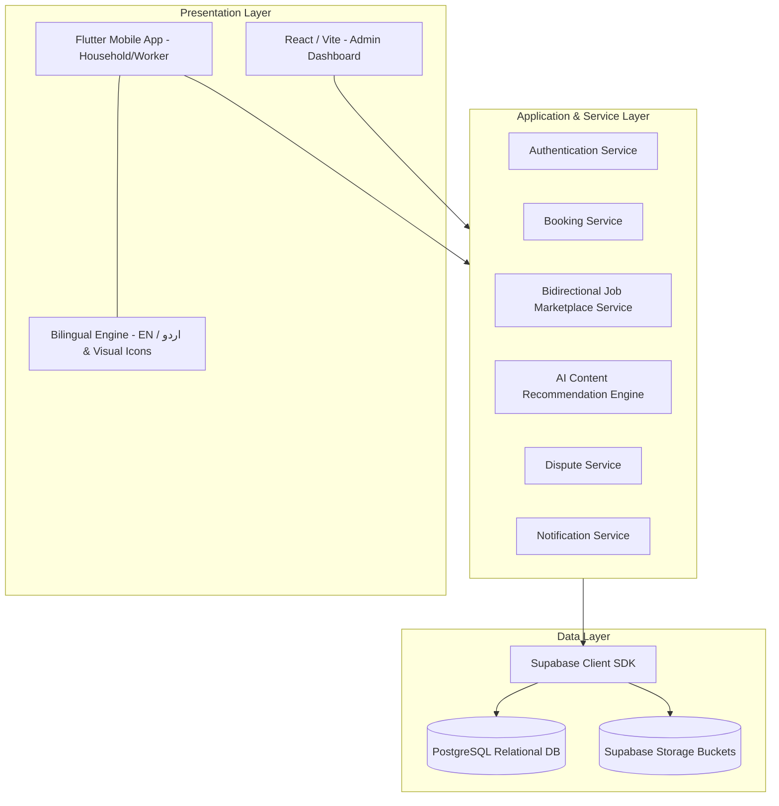

# Software Design Description (SDD) Summary

This document provides a comprehensive summary of the **HomeEase Software Design Description (SDD) Document (Version 1.0)**. It translates the functional requirements defined in the SRS into a concrete technical architecture, database schema, algorithmic workflows, and module traceability matrix.

---

## 1. What's in the SDD Document?

The SDD document defines the technical solution and blueprint for the HomeEase platform. It contains the following core sections:

1. **Introduction & Design Guidelines:** Establishes design principles (modularity, low coupling, high cohesion) and guidelines.
2. **Design Methodology & Process Model:** Outlines the object-oriented design and Agile iteration cycles.
3. **System Overview:** Describes the three-tier system: Flutter client (Household/Worker), React/Vite client (Admin), and Supabase backend (Authentication, PostgreSQL Database, and Storage Buckets).
4. **Design Models:** Includes visual design diagrams (Architecture, Use Case, Process Flows, Class, Sequence, and State transitions).
5. **Data Design:** Provides database tables, data dictionaries, schema types, and constraints.
6. **Algorithms & Implementation:** Outlines pseudo-code and flowcharts for search matching, double-booking prevention, verification, and dispute resolution.
7. **Software Requirements Traceability Matrix (RTM):** Traces every SRS functional requirement back to design modules and schema components.
8. **Human Interface Design:** Maps out screen-to-screen navigation hierarchies for all roles.

---

## 2. Key Architecture & Components

The HomeEase platform utilizes a modern three-tier, service-oriented architecture enhanced with an Explainable AI Recommender Engine and Bidirectional Job Board:

### Module Relations & Layer Responsibilities:
1. **Presentation Layer:** Interfaces with users. The Flutter app manages navigation states (`home_ease_flow.dart`), provides a global **Bilingual Toggle (`EN | اردو`)**, renders high-affordance visual icons for low-literacy domestic workers, and displays **Explainable AI Match % Badges**.
2. **Service Layer:** Houses core business and algorithmic intelligence:
   - `AI Recommendation Engine`: Vectorizes worker capabilities and household job requirements, computing Content-Based Cosine Similarity on skills/categories, Haversine geo-distance decay, and min-max rating normalization.
   - `Bidirectional Job Marketplace Service`: Manages Household gig postings (`JobPost`) and Worker discovery/applications (`JobApplication`).
   - `Booking Service`: Interacts with `Notification Service` and `Dispute Service`.
3. **Data Layer:** Utilizes Supabase PostgreSQL as the single source of truth with Row Level Security (RLS) policies. Includes dedicated tables for worker profiles, availability, service agreements, disputes, and the new bidirectional job marketplace entities.

---

## 3. Database Schema & Data Dictionary Summaries

The SDD details 16 database tables (including 60% additions):
- **`USERS`**: Master account records. Linked 1-to-1 to profiles.
- **`HOUSEHOLD_PROFILES`**: Contains employer metadata (address, city, area, preferred language).
- **`WORKER_PROFILES`**: Contains worker metadata (experience, bio, latitude, longitude, city, area, preferred language, verified status).
- **`SERVICE_CATEGORIES`** & **`WORKER_SERVICES`**: Define service specializations (cleaning, cooking, childcare, elderly care) and rates.
- **`AVAILABILITY_SLOTS`**: Day-of-week slots for worker availability.
- **`BOOKINGS`**: Transaction records connecting a household, a worker, and a specific service category on a given date/time.
- **`SERVICE_AGREEMENTS`**: Auto-generated text outlining scope and agreed amount for a booking.
- **`JOB_POSTS` (60% Stage)**: Open household task requests (title, category, locality, budget, date, status: open/assigned/closed).
- **`JOB_APPLICATIONS` (60% Stage)**: Worker applications submitted against open household job posts.
- **`PAYMENT_RECORDS`**: Submissions of payment details, including EasyPaisa/JazzCash transaction codes and receipts.
- **`REVIEWS`**: Ratings (1-5 scale) across punctuality, behavior, and quality, with qualitative text.
- **`VERIFICATION_REQUESTS`**: Worker credential records reviewed by admins (CNIC front/back, police clearance).
- **`DISPUTES`**: Claims filed against a transaction (booking/payment).
- **`ISSUE_REPORTS`**: Platform bug or user conduct reports.

---

## 4. Key Algorithmic Workflows

The SDD outlines six major algorithms:

1. **Content-Based AI Worker Recommendation Engine (Replacing Basic Static Filters):**
   - **Step 1 (Category & Skill Cosine Similarity):** Vectorizes household requirements and worker profile skills into binary feature vectors $\vec{u}$ and $\vec{w}$. Computes $\text{Sim}_{\text{skills}} = \frac{\vec{u} \cdot \vec{w}}{\|\vec{u}\| \|\vec{w}\|}$.
   - **Step 2 (Geographic Haversine Distance Decay):** Calculates spherical distance $d$ in km between household $(\text{lat}_1, \text{lon}_1)$ and worker $(\text{lat}_2, \text{lon}_2)$ using the Haversine formula. Proximity score is modeled as $S_{\text{geo}} = \frac{1}{1 + \alpha \cdot d}$ (where $\alpha = 0.2$).
   - **Step 3 (Normalized Rating Factor):** Normalizes worker rating $R \in [1, 5]$ to $S_{\text{rating}} = \frac{R - 1}{4} \in [0, 1]$.
   - **Step 4 (Composite Score & Match %):** Computes total score $S = w_1 \cdot \text{Sim}_{\text{skills}} + w_2 \cdot S_{\text{geo}} + w_3 \cdot S_{\text{rating}}$ (with weights $w_1 = 0.50$, $w_2 = 0.35$, $w_3 = 0.15$). Match percentage is $\text{Match \%} = \text{round}(S \times 100)$.
   - **Step 5 (Explainable AI Generation):** Outputs dynamic reasoning badges: e.g., `"94% AI Match • 1.2 km away in Mandian • Desi Cooking fit"`.
2. **Bidirectional Job Marketplace Flow:**
   - Household submits job post with category, Abbottabad locality, date, and budget $\rightarrow$ Record saved in `JOB_POSTS`.
   - Worker dashboard queries open `JOB_POSTS` matching worker's service category within geographic radius.
   - Worker taps "Apply" $\rightarrow$ Creates `JOB_APPLICATION` record and sends immediate notification alert to household.
3. **Bilingual & Low-Literacy Localization Switching:**
   - Detects language code (`en` or `ur`). Dynamically swaps string dictionaries and switches text direction (`LTR` vs `RTL`).
   - Renders high-affordance color-coded icons (Broom/Cleaning, Pot/Cooking, Stroller/Childcare, Wheelchair/Elderly Care) so low-literacy workers navigate visually without reading barriers.
4. **Booking Overlap/Double-Booking Prevention:**
   - Before confirming a booking, checks `AVAILABILITY_SLOTS` to verify the worker is active on that weekday.
   - Checks `BOOKINGS` for any active records where `worker_id = TargetWorker`, `booking_date = RequestedDate`, and the time ranges intersect. If an intersection is found, the request is rejected.
5. **Worker Verification Workflow:**
   - Worker submits CNIC front/back and character certificate $\rightarrow$ Status changes to `PendingVerification`.
   - Admin approves or rejects. If approved, status updates to `Verified` (unlocking verified badge in search). If rejected, the status changes to `RejectedVerification`, allowing resubmission.
6. **Dispute Resolution Flow:**
   - Either user files a dispute $\rightarrow$ State transitions to `OpenDispute`.
   - Admin marks it `InReview`, assesses evidence and receipts, and marks it `Resolved` or `RejectedDispute`.
