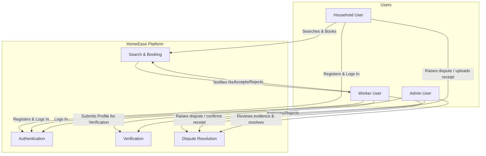

# Software Requirements Specification (SRS) Summary

This document provides a comprehensive summary of the **HomeEase Software Requirements Specification (SRS) Document (Version 1.0)**. It outlines the purpose, scope, functional requirements, use cases, user roles, system modules, external interfaces, and quality attributes of the HomeEase platform.

---

## 1. What's in the SRS Document?

The SRS document formally specifies what the HomeEase platform must do and the constraints under which it must operate. It is structured into the following sections:

1. **Introduction & Project Scope:** Explains the informal domestic hiring problem in Pakistan and how HomeEase provides a hyper-local centralized digital platform to solve it.
2. **Product Perspective & User Classes:** Establishes the role-based access for Households, Workers, and Admins.
3. **Requirement Gathering Techniques:** Details how requirements were collected via interviews, questionnaires, document analysis, and competitive reviews of products like Care.com, Handy, and Urban Company.
4. **Specific Functional Requirements:** Outlines module-by-module features for authentication, profiles, search/filtering, bookings, reviews, notifications, disputes, and admin tools.
5. **Non-Functional Requirements & Quality Attributes:** Details performance, security, availability, and usability requirements.
6. **External Interface Requirements:** Outlines user, hardware, software, and communication interfaces.
7. **Project Gantt Chart & References:** Outlines the schedule for iteration and development phases.

---

## 2. Key Target Modules & Scope

### In-Scope (Core Features & 60% Committee Mandates)
- **Mobile Application:** Built with Flutter/Dart for Household and Worker users.
- **Admin Dashboard:** Built with React/Vite for Admin users.
- **Backend & Database:** Supabase authentication and PostgreSQL database.
- **Core Functional Modules:**
  1. *Authentication & Role Management:* Secure login/registration and role choice.
  2. *Household User Management:* Profile information, preferences, and booking history.
  3. *Worker Profile Management:* Bios, experience, charges, availability slots, and visibility.
  4. *Worker Verification:* Identity confirmation, profile completeness, and admin verification status.
  5. *Service Categories & Pricing:* Maid, cook, cleaner, nanny, caregiver categories, and worker rates.
  6. *AI-Based Content Recommendation Engine (60% Mandate):* Algorithmic worker recommendation using Cosine Similarity on skills/categories, Haversine geo-distance, and rating normalization with Explainable AI badges (`Match %` + reason), strictly replacing static dropdown filters.
  7. *Bidirectional Job Marketplace (60% Mandate):* Household "Post a Job / Request" workflow and Worker "Available Jobs / Browse & Apply" feed for direct gig acquisition.
  8. *Bilingual UI & Visual Iconography (60% Mandate):* Dual-language toggle (`EN | اردو`) and high-affordance visual icons for low-literacy domestic workers.
  9. *Booking & Availability:* Date/time slot booking, status tracking, and scheduling conflict prevention.
  10. *Service Agreements:* Auto-generated formal service agreements prior to booking confirmation.
  11. *Manual Payment Logging:* Direct Cash, EasyPaisa, JazzCash tracking with receipt uploads.
  12. *Rating & Behavioral Reviews:* Multi-factor rating (performance, punctuality, behavior) after service completion.
  13. *Notification & Communication:* Automated push notifications/alerts for bookings, updates, and messages.
  14. *Admin Dashboard Management:* User overviews, verification approvals, bookings monitor, and dispute resolution.

### Out-of-Scope (Excluded Features)
- Online automated payment gateway escrow (EasyPaisa/JazzCash merchant escrow APIs) - manual receipt uploads and confirmation are handled instead.
- Government-level, NADRA, or police database live API verification.
- Direct legal employment contract enforcement in labor courts.
- In-app video calling or real-time voice chat.
- Static dropdown/filter-only matching presented as recommendation (explicitly rejected by FYP committee).

---

## 3. System Roles & Interactions (Relationships)

The SRS describes the platform through the lens of three primary user classes and their relationships:

### User Class Relationships:
1. **Household User $\leftrightarrow$ Worker User:**
   - Households search and discover workers near them.
   - Households initiate bookings; Workers accept or reject.
   - Both parties view automatically generated service agreements.
   - Households pay workers (manually) and upload receipts; Workers confirm receipt.
   - Households write reviews and rate workers; ratings affect workers' search visibility.
   - In case of booking or payment issues, either party can raise disputes.
2. **Worker User $\leftrightarrow$ Admin User:**
   - Workers submit verification requests (ID details, skills, experience).
   - Admins review and approve/reject verification requests, assigning a "Verified" badge.
3. **Household/Worker $\leftrightarrow$ Admin User:**
   - Households or Workers raise disputes (e.g., payment discrepancies).
   - Admins review dispute evidence and assign resolution status, updating bookings or user accounts.

---

## 4. Use Case Descriptions

The system behavior is defined by core Use Cases across all roles and system components:

| Use Case ID | Use Case Name | Primary Actor | Description |
|---|---|---|---|
| **UC-1** | Register Account | Household User, Worker User | A new user creates a secure account and stores their selected role. |
| **UC-2** | Log In | Household, Worker, Admin | User logs in using valid credentials. Determines role flow redirects. |
| **UC-3** | Create Worker Profile | Worker User | Worker configures bio, services, expected charges, area, and availability. |
| **UC-4** | Verify Worker Profile | Admin User | Admin reviews worker profile details and approves or rejects verification. |
| **UC-5** | Search Workers | Household User | Household searches for available workers by category, city/area, and ratings. |
| **UC-6** | Send Booking Request | Household User | Household enters booking details (date, time, address, notes) and sends to a worker. |
| **UC-7** | Accept or Reject Booking | Worker User | Worker views pending booking requests and accepts or rejects them. |
| **UC-8** | Submit Rating & Review | Household User | Household rates worker performance, behavior, and punctuality after completion. |
| **UC-9** | Admin Dashboard Overview | Admin User | Admin monitors platform activity, including user lists, bookings, and reports. |
| **UC-10** | Post Job / Gig Request | Household User | Household posts an open task/job specifying service type, budget, time, and Abbottabad locality. |
| **UC-11** | Browse & Search Available Jobs | Worker User | Worker views a live feed of open household job postings matching their skills and area. |
| **UC-12** | Apply for Job / Express Interest | Worker User | Worker applies to an open job post with proposed rate and contact notice. |
| **UC-13** | View AI-Recommended Workers | Household User | Household receives algorithmic worker recommendations with Explainable AI badges (`Match %` and reasons). |
| **UC-14** | Toggle Bilingual Mode & Visual Icons | Household / Worker | User switches between English and Urdu (`اردو`) with iconographic visual cues for low-literacy workers. |

---

## 5. Specific Functional Requirements

Below is the list of functional requirements (FR) defined in the SRS:

| ID | Title | Requirement Specification | Priority |
|---|---|---|---|
| **FR-01** | User Registration | The system shall allow household and worker users to register accounts. | High |
| **FR-02** | User Login | The system shall allow registered users to log in securely. | High |
| **FR-03** | Role Choice on Login | The mobile login screen shall allow the user to continue as household or worker. | High |
| **FR-04** | Role-Based Access | The system shall display features according to the user's role. | High |
| **FR-05** | Household Profile | The system shall allow household users to manage profile, contact, address, and service preferences. | High |
| **FR-06** | Worker Profile | The system shall allow workers to create and update professional profiles. | High |
| **FR-07** | Service Categories | The system shall allow workers to select service categories such as maid, cook, cleaner, nanny, and caregiver. | High |
| **FR-08** | Pricing Information | The system shall allow workers to enter expected charges. | Medium |
| **FR-09** | Availability Management | The system shall allow workers to manage availability. | High |
| **FR-10** | Worker Verification | The system shall allow admins to approve or reject worker verification. | High |
| **FR-11** | Search Workers | The system shall allow households to search workers by service type and city/area. | High |
| **FR-12** | Filter Workers | The system shall allow filtering by availability, rating, experience, and service category. | High |
| **FR-13** | View Worker Profile | The system shall allow households to view worker details, services, pricing, availability, rating, and verification status. | High |
| **FR-14** | Create Booking Request | The system shall allow households to send booking requests with service type, date, time, address, and notes. | High |
| **FR-15** | Booking Response | The system shall allow workers to accept or reject booking requests. | High |
| **FR-16** | Booking Status | The system shall maintain booking statuses such as pending, accepted, rejected, cancelled, and completed. | High |
| **FR-17** | Rating and Review | The system shall allow households to rate and review workers after completed services. | Medium |
| **FR-18** | Notifications | The system shall notify users about booking requests, responses, verification status, and important updates. | Medium |
| **FR-19** | Basic Communication | The system shall support coordination through booking notes and visible accepted-booking contact details. | Medium |
| **FR-20** | Admin Web Login | The system shall allow admin users to log in to a web dashboard. | High |
| **FR-21** | Admin User Management | The system shall allow admins to view household and worker users. | Medium |
| **FR-22** | Admin Booking Overview | The system shall allow admins to view booking records and statuses. | Medium |
| **FR-23** | Report Handling | The system should allow admins to view and handle reported issues. | Low |
| **FR-24** | Household Job Posting | The system shall allow households to publish open gigs specifying category, Abbottabad locality, date/time, and budget. | High |
| **FR-25** | Worker Job Feed | The system shall allow workers to discover and browse open household job posts matching their skills. | High |
| **FR-26** | Worker Job Application | The system shall allow workers to apply for open gigs with one tap, notifying the household. | High |
| **FR-27** | AI Content Recommender | The system shall compute a Content-Based match score using Cosine Similarity on skills/categories, Haversine geo-distance, and rating normalization. | High |
| **FR-28** | Explainable AI Badges | The system shall display transparent match explanations (e.g. `94% AI Match`, `1.2 km away`, `Desi Cooking fit`) on recommended profiles. | High |
| **FR-29** | Bilingual Interface Toggle | The system shall provide a global language switch between English and Urdu (`اردو`) preserving user preference. | High |
| **FR-30** | Low-Literacy Visual Icons | The system shall provide distinct, high-affordance pictorial icons for all service tasks and booking statuses. | High |

---

## 6. Key Constraints & Non-Functional Requirements

- **Availability:** System uptime target is 99.5% excluding scheduled maintenance.
- **Performance:** Location search results must load in < 2 seconds, and booking states must update instantly.
- **Security:** GDPR-compliant user data storage. Password hashing, TLS communication, and role-based row-level security (RLS) on Supabase.
- **Usability:** High responsiveness on multiple Android/iOS screen sizes. Clear, visual layouts suitable for workers with low digital literacy.
- **Database Consistency:** Prevention of double-booking slots for workers on the same date/time.
