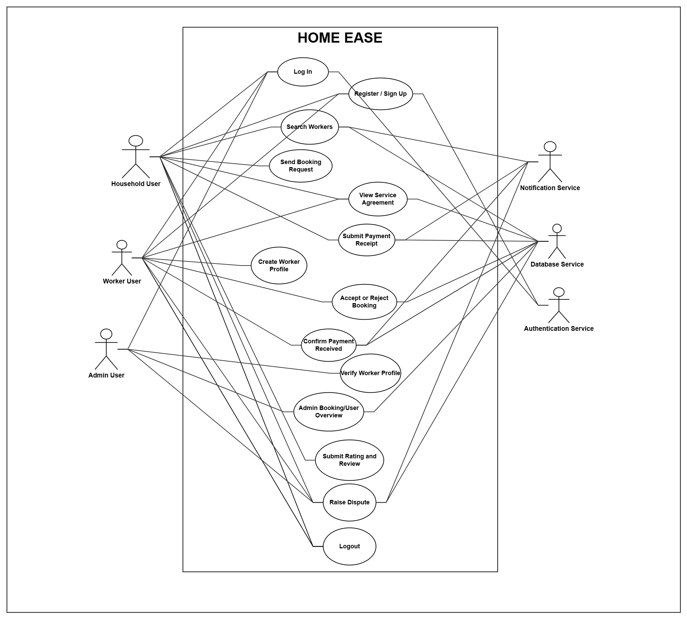
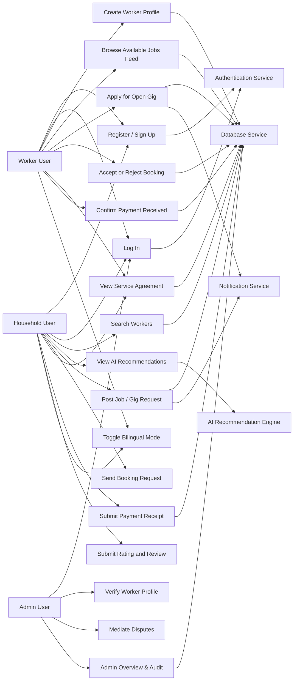
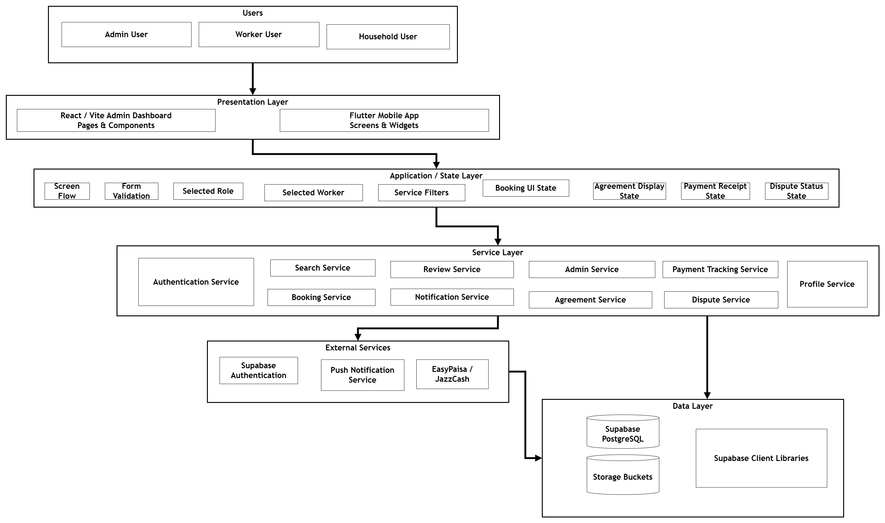
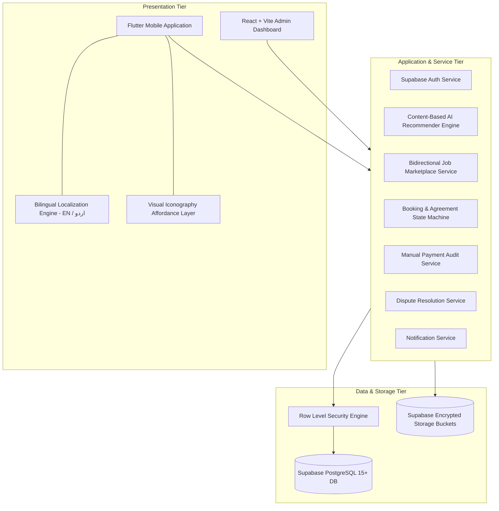
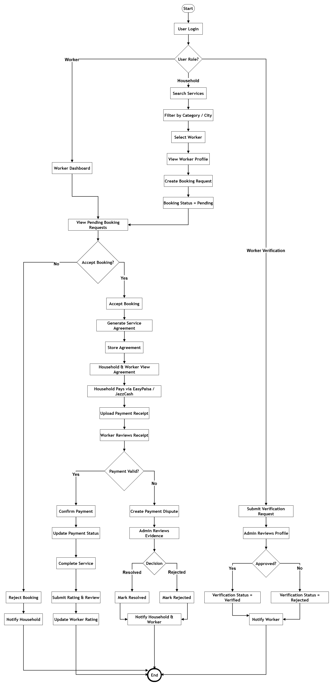
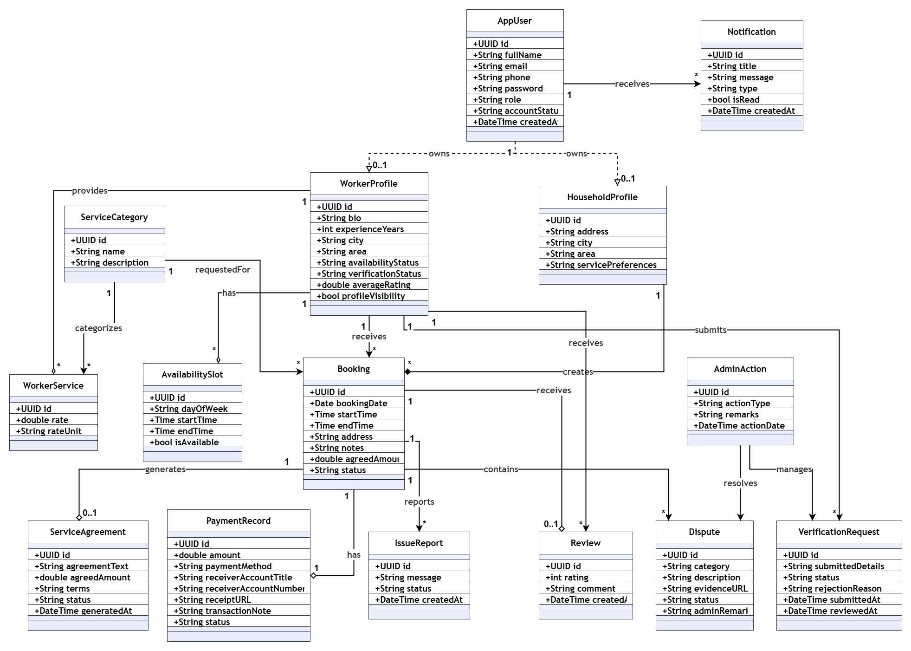
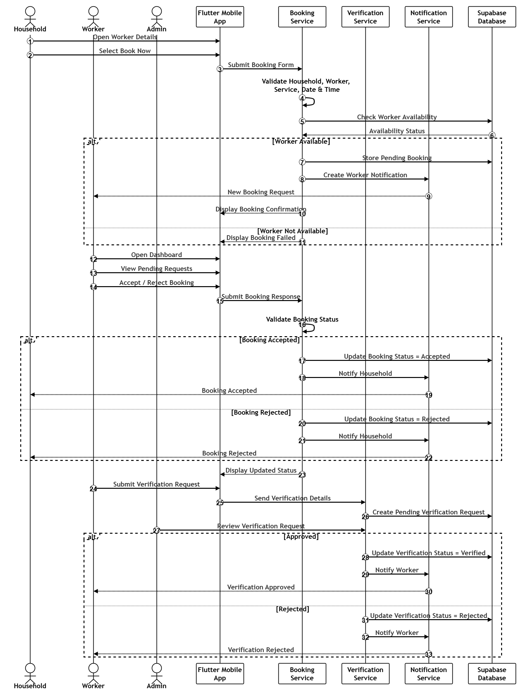
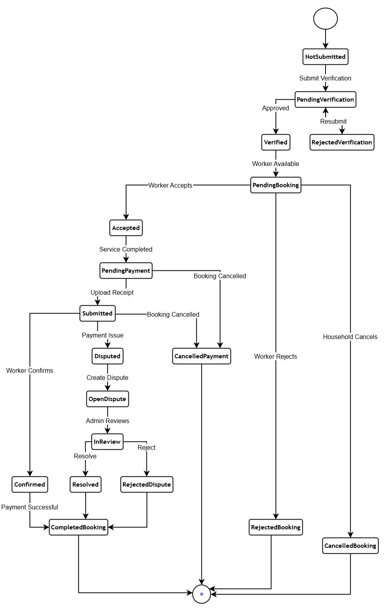
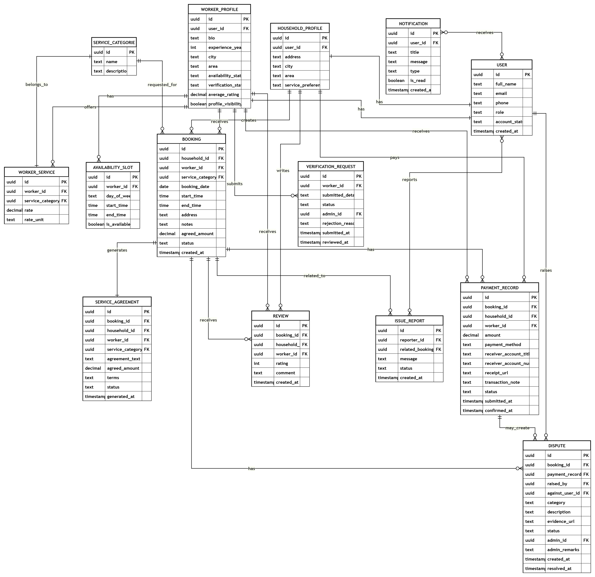

# HomeEase: Hyper-Local Domestic Worker Connect Platform with Explainable AI Recommendation & Bidirectional Marketplace

## 60% Evaluation Thesis Report

**Institution:** COMSATS University Islamabad, Abbottabad Campus  
**Department:** Department of Computer Science  
**Program:** Bachelor of Science in Software Engineering / Computer Science (Session 2022–2026)  
**Project Title:** HomeEase: Hyper-Local Domestic Worker Connect Platform with Explainable AI Recommendation & Bidirectional Marketplace  
**Supervisor:** Sir Sumair Khan (Lecturer, Department of Computer Science)  

**Project Team Members:**
* **Hashir Hamid** — `CIIT/FA22-BSE-139/ATD`
* **Aman Ullah Khan** — `CIIT/FA22-BSE-074/ATD`
* **Umar Saeed** — `CIIT/FA22-BCS-041/ATD`

*The candidate confirms that the work submitted is their own and appropriate credit has been given where reference has been made to the work of others.*

---

## Certificate of Approval & Declaration of Authorship

We hereby declare that this 60% Final Year Project Thesis Report entitled *"HomeEase: Hyper-Local Domestic Worker Connect Platform with Explainable AI Recommendation and Bidirectional Marketplace"* is our own original work. No portion of this work has been submitted in support of any other application for another degree or qualification at this or any other university or institute of learning. Appropriate credit, citations, and references have been duly provided wherever external concepts, libraries, frameworks, or standards have been consulted.

The project has been developed under the academic supervision of **Sir Sumair Khan** at the Department of Computer Science, COMSATS University Islamabad, Abbottabad Campus. The active system adheres strictly to the directives and scope refinements issued by the FYP Evaluation Committee on 2026-09-29, introducing an authentic Content-Based AI recommendation engine, a bidirectional job marketplace, bilingual (Urdu/English) localization, and an Abbottabad cold-start evaluation dataset.

| Signature | Name & Roll Number | Role |
|---|---|---|
| ____________________ | **Hashir Hamid** (`CIIT/FA22-BSE-139/ATD`) | Lead Mobile Engineer & System Architect |
| ____________________ | **Aman Ullah Khan** (`CIIT/FA22-BSE-074/ATD`) | Full-Stack & Database Engineer |
| ____________________ | **Umar Saeed** (`CIIT/FA22-BCS-041/ATD`) | AI & Algorithmic Specialist |
| ____________________ | **Sir Sumair Khan** | Project Supervisor |

---

## Executive Summary & Abstract

In Pakistan, the domestic informal labor sector—encompassing cooks, cleaners, maids, child nannies, and elderly caregivers—remains largely opaque, decentralized, and governed by informal word-of-mouth networks. This informal hiring paradigm introduces severe friction: households confront safety risks, lack of identity verification, and unpredictable service quality, while domestic workers suffer from arbitrary wage negotiation, undefined task scopes, delayed cash compensations, and lack of professional reputation portability. Furthermore, conventional digital platforms fail in the Pakistani local market because they assume universal English literacy, rely on automated credit card payment gateways that domestic workers cannot access, and employ static database dropdown filters disguised as "recommendations".

To overcome these socio-economic and technical deficits, this project presents **HomeEase**, a hyper-local domestic worker marketplace designed specifically for local Pakistani dynamics, with primary empirical validation in Abbottabad. HomeEase establishes a structured mobile ecosystem built using Flutter and Dart, backed by Supabase PostgreSQL with Row Level Security (RLS). At this 60% evaluation milestone, HomeEase successfully fulfills the four official mandates issued by the FYP Evaluation Committee:
1. **Authentic Content-Based Vector Similarity Recommender System** combining Cosine Similarity on skill feature spaces, Haversine geospatial proximity decay, and min-max rating normalization with Explainable AI (XAI) transparent match badges;
2. **Bidirectional Job Marketplace** allowing households to publish open gigs and domestic workers to actively browse and apply for local neighborhood opportunities;
3. **Bilingual Urdu/English localization layer (`EN | اردو`)** with high-affordance visual task icons tailored for low-literacy informal workers; and
4. **Abbottabad synthetic seed dataset and cold-start evaluation benchmark**.

---

## Acknowledgements

We express our deepest gratitude to Almighty Allah for bestowing upon us the wisdom, health, and perseverance to accomplish this mid-term 60% software engineering milestone. We extend our sincere appreciation to our project supervisor, Sir Sumair Khan, for his invaluable technical mentorship, constructive critiques, and continuous guidance throughout the architectural design and implementation stages.

We also thank the faculty members of the Department of Computer Science at COMSATS University Islamabad, Abbottabad Campus, for their rigorous evaluation feedback during the 30% milestone review, which fundamentally elevated the technical depth of this project. Lastly, we owe immense appreciation to our families, fellow students, and our technical mentor AbuZar Babar for their unwavering encouragement, collaborative discussions, and continuous moral support.

---

## List of Abbreviations & Acronyms

| Abbreviation | Definition |
|---|---|
| **AI** | Artificial Intelligence |
| **BaaS** | Backend as a Service |
| **CNIC** | Computerized National Identity Card (Pakistan NADRA) |
| **ERD** | Entity Relationship Diagram |
| **FK** | Foreign Key |
| **HCI** | Human-Computer Interaction |
| **JWT** | JSON Web Token |
| **KYC** | Know Your Customer (Identity & Background Verification) |
| **PK** | Primary Key |
| **REST** | Representational State Transfer |
| **RLS** | Row Level Security (PostgreSQL) |
| **SDD** | Software Design Description |
| **SRS** | Software Requirements Specification |
| **XAI** | Explainable Artificial Intelligence |

---

## Table of Development Requirements & Technology Stack

| Category | Selected Technology | Purpose & Role in HomeEase |
|---|---|---|
| **Mobile Client** | Flutter SDK 3.x + Dart 3.x | Cross-platform mobile app for Households and Domestic Workers with custom Material 3 theming and responsive layouts. |
| **Admin Web Portal** | React 18 + Vite + TypeScript + Tailwind | Administrative governance portal for worker CNIC document verification, booking audits, and dispute resolution. |
| **Backend Database** | Supabase (Managed PostgreSQL 15+) | ACID-compliant relational database enforcing multi-role data relationships and granular Row Level Security (RLS). |
| **Authentication** | Supabase Auth (JWT & Phone OTP) | Secure role-based session management, password hashing, and planned SMS/Phone verification. |
| **Cloud Object Storage** | Supabase Storage Buckets | Encrypted cloud bucket storage for worker CNIC front/back scans, police certificates, and manual payment receipt images. |
| **AI Recommendation Engine** | Content-Based Vector Scorer (Dart/Python) | Algorithmic worker recommendation using Cosine Similarity on skill embeddings, Haversine geo-decay, and rating normalization. |
| **Bilingual Localization** | Custom In-App Localization Engine | Dynamic English/Urdu (`اردو`) text translation dictionary, right-to-left layout adaptation, and visual iconography affordance. |
| **Offline & Local Data** | Dart Seed Models & Abbottabad Dataset | Synthetic dataset representing 50 Abbottabad workers and 30 household gigs across Mandian, Jhangi, Supply, and Nawan Shehr. |

---

# Chapter 1: Introduction

## 1.1 Brief Introduction
HomeEase is an enterprise-grade, hyper-local domestic worker connect platform specifically architected to formalize and secure the informal home-services sector in Pakistan. The platform bridges the deep trust deficit between two primary stakeholders: urban households seeking reliable, safe domestic assistance (such as cooks, cleaners, maids, child nannies, and elderly caregivers), and informal domestic workers who require reliable employment visibility, fair compensation, and professional reputation portability.

In urban and semi-urban Pakistani centers like Abbottabad, domestic worker hiring has historically been restricted to physical word-of-mouth, informal intermediaries, or gatekeeper referrals. These informal channels lack background identity checks, verifiable service histories, transparent task specifications, and standardized wage metrics. Consequently, employers face security risks and unpredictable absenteeism, while domestic workers are exposed to exploitative working hours, arbitrary wage cuts, and zero dispute recourse.

HomeEase establishes a structured digital bridge through a three-tier architecture comprising a Flutter mobile application for both households and workers, a React/Vite admin dashboard for regulatory governance, and a Supabase PostgreSQL backend. At this 60% evaluation stage, HomeEase extends beyond conventional single-sided directory apps by delivering an Explainable AI (XAI) Recommendation Engine, a Bidirectional Job Marketplace, and a specialized Bilingual/Iconographic accessibility interface tailored for low-literacy workers.

## 1.2 Relevance to Course Modules
The engineering lifecycle and architectural implementation of HomeEase synthesize theoretical knowledge and practical competencies acquired across five core academic modules of the Software Engineering curriculum at COMSATS University Islamabad:

1. **CSC392 (Software Engineering):** Methodical application of the Agile Scrum methodology, requirement identification techniques, formal SRS and SDD authoring, UML object-oriented modeling, and Software Requirements Traceability Matrices (RTM).
2. **CSC341 (Database Systems):** Relational database architecture, Third Normal Form (3NF) relational decomposition, entity integrity, foreign key cascading constraints, index optimization, and PostgreSQL Row Level Security (RLS) policies.
3. **CSC475 (Artificial Intelligence):** Formalization of a Content-Based Recommender System, multi-dimensional feature space vectorization, Cosine Similarity distance metrics in high-dimensional discrete spaces, Haversine spherical distance formulas, min-max normalization, and Explainable AI (XAI) badge synthesis.
4. **CSC483 (Mobile Application Development):** Cross-platform Flutter architecture, Dart asynchronous programming (Futures, Streams), reactive UI state binding, localized layout constraints, and native hardware sensor integration.
5. **CSC412 (Human-Computer Interaction):** Usability engineering, accessibility for low-literacy demographics, bilingual right-to-left (RTL) typography handling, and visual iconography affordance design.

## 1.3 Project Background
The HomeEase project commenced with the 10% Proposal Milestone, identifying the socio-technical breakdown of informal domestic worker hiring in Pakistan. The subsequent 30% Milestone formulated the complete Software Requirements Specification (SRS v1.0) and Software Design Description (SDD v1.0), along with a 15-screen client-side Flutter prototype executing on an interactive state machine.

During the 60% evaluation review on 2026-09-29, the FYP Evaluation Committee established four mandatory technical directives:
1. Implementing an authentic AI recommendation engine rather than simple SQL filter dropdowns;
2. Creating a two-sided bidirectional marketplace enabling workers to search and apply for household gigs;
3. Introducing bilingual English/Urdu localization with visual iconography for low-literacy workers; and
4. Validating the system with an empirical dataset from Abbottabad.

## 1.4 Literature Review
A rigorous literature review of international and regional on-demand service platforms reveals distinct operational models and limitations:
1. **Urban Company (formerly UrbanClap, India/UAE):** Employs a full-stack managed marketplace model where the platform sets prices, trains workers, and takes commission. While highly standardized, it requires heavy capital investment, complete digital banking penetration, and excludes informal, low-literacy workers who lack formal trade licenses.
2. **Care.com (USA / Global):** A subscription-based caregiving directory connecting families with nannies and caregivers. It relies heavily on Social Security Number (SSN) background checks, mandatory monthly credit card subscriptions, and extensive written text profiles, rendering it completely unsuited for the cash-based, low-literacy Pakistani market.
3. **Handy & TaskRabbit (USA / Europe):** Gig platforms focusing on handyman tasks, cleaning, and furniture assembly. Both rely on automated credit card escrow and gig-worker bidding. Neither accommodates informal cash settlement, nor do they support visual affordance for workers who cannot read Latin scripts.
4. **KaamKaaj & Local Classifieds (Pakistan / OLX):** Local classified platforms simply publish unverified phone numbers and raw text blurbs. They offer zero identity verification, no auto-generated service agreements, no double-booking prevention, no dispute resolution, and zero recommendation intelligence.

## 1.5 Analysis from Literature Review

| Platform | Hyper-Local Matching | Verification Pipeline | Payment Inclusivity | Bidirectional Job Board | AI-Driven Recommender | Low-Literacy & Urdu UI | Formal Service Agreement |
|---|---|---|---|---|---|---|---|
| **Urban Company** | High | Full Trade Audit | Credit/Debit Cards Only | No (Assigned) | Complex Proprietary | English/Hindi (Text) | Standard Terms |
| **Care.com** | Zipcode | SSN Check | Credit Cards Only | Yes (Job Posts) | Collaborative Filtering | English Only | No |
| **TaskRabbit** | Zipcode | Third-Party KYC | Automated Escrow | Yes (Tasks Feed) | Heuristic Search | English Only | Platform Terms |
| **Pak Classifieds** | City Level | None (Unverified) | Informal Cash (Untracked) | No (Raw Listings) | Static Dropdown Query | English / Urdu Text | None |
| **HomeEase (Ours)** | **Abbottabad Geo-Proximity** | **CNIC + Police KYC** | **Manual Cash/JazzCash + Receipts** | **Yes (Post & Browse Feed)** | **Content-Based Vector XAI** | **Bilingual EN/اردو + Visual Icons** | **Auto-Generated Agreement** |

**Critical Research Gaps Identified:** The comparative analysis demonstrates that no existing platform bridges hyper-local domestic worker connectivity with explainable AI matching, informal payment auditability (Cash/JazzCash/EasyPaisa), formal contract generation, and bilingual accessibility tailored for low-literacy workers in semi-urban Pakistan. HomeEase directly addresses this vacuum.

## 1.6 Methodology and Software Lifecycle for This Project
HomeEase is developed following the Agile Scrum methodology, organized into two-week development sprints. Agile was selected because domestic worker marketplace workflows require continuous usability testing with both high-literacy employers and low-literacy service providers.

The project lifecycle maps directly to academic milestone checkpoints:
* **10% Milestone (Proposal):** Problem definition, literature review, technical feasibility, and high-level module planning.
* **30% Milestone (SRS & SDD):** Formal specification of 32 functional requirements, comprehensive UML design suite, 14-table database schema, and client-side Flutter prototype.
* **60% Milestone (Mid-Term Implementation - Active):** Incorporation of the four Committee Mandates: Content-Based AI Recommendation Engine with XAI match badges, Bidirectional Job Marketplace, Bilingual Urdu/English Engine with visual icons, Abbottabad synthetic dataset, and Supabase PostgreSQL integration.
* **100% Milestone (Final Defense):** Live SMS OTP gateway, comprehensive Usability Testing across Abbottabad demographic cohorts, performance benchmarking, and final thesis.

---

# Chapter 2: Problem Definition

## 2.1 Problem Statement
The informal domestic hiring sector in Pakistan suffers from systemic institutional and technological failure, manifested across six core operational pillars:
1. **Complete Lack of Background Verification:** Households admit domestic workers into private residential spaces with zero verifiable identity records. No centralized repository exists to inspect CNIC authenticity, police character clearance, or past disciplinary histories, creating significant personal and physical security risks.
2. **Information Asymmetry and Informal Wage Exploitation:** Absence of standardized rate cards leads to arbitrary price gouging by workers or unfair wage depression by employers. Workers lack reputation portability; five years of honest service for one household cannot be digitally proven when seeking employment with another.
3. **Single-Sided Friction in Gig Discovery:** Traditional platforms treat workers as passive entries in a directory. Workers sitting idle have no mechanism to view nearby households needing immediate assistance, creating severe underemployment.
4. **Exclusionary Literacy and Language Barriers:** The majority of domestic workers in Pakistan cannot read English, and many have limited Urdu text literacy. Digital platforms built exclusively with dense text menus and complex navigation exclude the very demographic they aim to empower.
5. **Cold-Start Failure in Traditional Recommender Systems:** Collaborative filtering algorithms rely on millions of historical interaction matrices, causing complete failure during early deployment. Conversely, simple SQL `WHERE` queries lack algorithmic intelligence and fail academic standards.
6. **Unrealistic Digital Payment Gateways:** Mandating automated credit card escrow excludes 95% of domestic workers who operate exclusively in cash or basic mobile wallets (EasyPaisa / JazzCash).

## 2.2 Deliverables and Development Requirements

| Stage | Scope Focus | Deliverables Completed / Targeted | Status |
|---|---|---|---|
| **10% Stage** | Concept & Proposal | Initial proposal document, slide deck, competitive analysis, feasibility assessment. | Approved |
| **30% Stage** | Analysis & Prototyping | SRS v1.0 (32 FRs), SDD v1.0 (14 tables, 9 UML diagrams), client Flutter prototype (15 screens). | Approved |
| **60% Stage** | Main Full-Stack & AI | AI Content Recommender with XAI badges, Bidirectional Job Board, Bilingual EN/اردو toggle, Abbottabad seed data, Supabase schema & RLS, 60% Thesis. | Active (Delivered) |
| **100% Stage** | Final Polish & Defense | Live SMS OTP integration, field usability testing in Abbottabad, performance benchmarking, final thesis and defense. | Roadmap |

---

# Chapter 3: Requirement Analysis

## 3.1 System Boundary & Use Case Diagram
The HomeEase system boundary encompasses three primary external actors (Household User, Domestic Worker User, and Platform Administrator) interacting with core backend services (Authentication Service, Database Service, AI Recommendation Service, and Notification Service).

## 3.2 Detailed Use Case Specifications

### UC-HH-01: Household Registration & Profile Setup
* **Actor:** Household User
* **Trigger:** User selects "Register as Household" on onboarding screen.
* **Preconditions:** Network connectivity available. Valid email/phone.
* **Postconditions:** User authentication and household profile created in Supabase database.
* **Main Flow:**
  1. User selects Household role.
  2. User enters name, email/phone, password, and Abbottabad locality (e.g. Mandian).
  3. System validates credential formats.
  4. System registers user in auth store and creates `HOUSEHOLD_PROFILES` record.
  5. User is redirected to Household Discovery Hub.
* **Alternative Flows:**
  * AF-1: Email/phone already in use $\rightarrow$ Displays duplicate account message.

### UC-HH-02: Discover Workers via Content-Based AI Recommender
* **Actor:** Household User
* **Trigger:** Household opens search hub and selects service category.
* **Preconditions:** Household locality coordinates available.
* **Postconditions:** Displays ranked list of worker cards with dynamic Explainable AI badges.
* **Main Flow:**
  1. Household selects category (e.g., Desi Cooking).
  2. System extracts requirement vector and household GPS coordinates.
  3. AI Engine computes Cosine Similarity on skills, Haversine geo-decay, and rating normalization.
  4. System ranks candidate profiles by composite score.
  5. UI renders cards with match badges (e.g., `94% AI Match • 1.2 km away in Mandian`).

### UC-HH-03: Publish Open Household Gig / Job Post (Bidirectional Marketplace)
* **Actor:** Household User
* **Trigger:** Household taps "Post a Job" from mobile dashboard.
* **Preconditions:** Authenticated household session.
* **Postconditions:** New record created in `JOB_POSTS` with status `open`; matching workers alerted.
* **Main Flow:**
  1. Household specifies job title, service category, date/time, Abbottabad area, and budget.
  2. Household submits job post.
  3. System validates input and persists record in `JOB_POSTS`.
  4. Notification engine dispatches alerts to matching nearby domestic workers.
  5. Gig appears on the Worker "Available Jobs" feed.

### UC-WK-03: Browse Available Jobs Feed & Apply (Bidirectional Marketplace)
* **Actor:** Domestic Worker User
* **Trigger:** Worker taps "Find Jobs" tab on mobile dashboard.
* **Preconditions:** Worker has active profile and verified skill categories.
* **Postconditions:** Worker submits job application; household receives proposal notice.
* **Main Flow:**
  1. Worker opens live jobs feed.
  2. System queries open `JOB_POSTS` matching worker's trade and locality.
  3. Worker inspects task scope, date, and offered budget.
  4. Worker taps "Apply Now" with optional proposed rate.
  5. System records entry in `JOB_APPLICATIONS` and alerts the employer.

### UC-SYS-01: Content-Based AI Worker Scoring Engine
* **Actor:** System Recommender Engine
* **Trigger:** Household executes search or opens recommendations.
* **Preconditions:** Target skill vector and location coordinates available.
* **Postconditions:** Normalized composite match scores $[0, 1]$ and XAI explanation strings synthesized.
* **Main Flow:**
  1. Encodes household requirement vector $\vec{u}$ and candidate worker vectors $\vec{w}_i$.
  2. Calculates Cosine Similarity: $\text{Sim}_{\text{skills}}(\vec{u}, \vec{w}_i) = \frac{\vec{u} \cdot \vec{w}_i}{\|\vec{u}\|_2 \|\vec{w}_i\|_2}$.
  3. Computes Haversine spherical surface distance $d_i$ in km.
  4. Computes proximity decay score: $S_{\text{geo}} = \frac{1}{1 + 0.2 d_i}$.
  5. Normalizes ratings to $[0, 1]$ (assigning prior $R=3.5$ for new workers).
  6. Computes composite score: $S = 0.50 \text{Sim}_{\text{skills}} + 0.35 S_{\text{geo}} + 0.15 S_{\text{rating}}$.
  7. Formats XAI badge string: `"Match % • Distance • Top Skill Fit"`.

### UC-GEN-01: Bilingual Language & Visual Affordance Toggle
* **Actor:** Household / Domestic Worker
* **Trigger:** User taps language toggle button (`EN | اردو`) in app bar.
* **Preconditions:** App is running.
* **Postconditions:** All strings translate; layout direction mirrors to RTL for Urdu; visual icons render.
* **Main Flow:**
  1. User clicks language toggle button.
  2. Locale state updates to `ur` (or `en`).
  3. Interface re-renders using the target localization dictionary.
  4. Material layout switches text direction from LTR to RTL.
  5. High-contrast pictorial icons (Broom, Cooking Pot, Stroller, Wheelchair) display on category cards for low-literacy workers.

---

## 3.3 Functional Requirements Matrix (36 Items)

| ID | Subsystem | Functional Requirement Specification | Priority |
|---|---|---|---|
| **FR-01** | Auth | Allow household and worker registration using email/phone and password. | High |
| **FR-02** | Auth | Authenticate users and issue role-specific JWT sessions. | High |
| **FR-03** | Auth | Provide instant role switching and demo credential auto-fill for testing. | Medium |
| **FR-04** | Auth | Enforce route guards preventing unauthorized cross-role access. | High |
| **FR-05** | Household | Allow households to manage profile, contact info, and Abbottabad locality. | High |
| **FR-06** | Worker | Allow workers to manage professional profile, bio, experience, and locality. | High |
| **FR-07** | Worker | Allow workers to select service categories (Cooking, Cleaning, Childcare, Elderly Care). | High |
| **FR-08** | Worker | Allow workers to configure hourly or visit-based pricing per service category. | Medium |
| **FR-09** | Worker | Provide weekly calendar allowing workers to toggle availability slots by day. | High |
| **FR-10** | KYC | Allow workers to upload CNIC front/back images and character certificates. | High |
| **FR-11** | AI Matching | Vectorize household requirements and compute Content-Based Cosine Similarity on skills. | High |
| **FR-12** | AI Matching | Calculate Haversine geographic distance between household and worker coordinates. | High |
| **FR-13** | AI Matching | Compute composite match score and render transparent Explainable AI badges. | High |
| **FR-14** | Job Board | Allow households to publish open gigs specifying category, budget, date, and locality. | High |
| **FR-15** | Job Board | Display live feed of open gigs to domestic workers matching trade and locality. | High |
| **FR-16** | Job Board | Allow domestic workers to apply to open gigs with one tap. | High |
| **FR-17** | Job Board | Alert households immediately upon receiving worker job applications. | High |
| **FR-18** | Booking | Allow households to create direct booking requests with date, times, and task scope. | High |
| **FR-19** | Booking | Enforce double-booking lock preventing scheduling conflicts. | High |
| **FR-20** | Booking | Allow workers to accept or reject incoming booking requests. | High |
| **FR-21** | Booking | Maintain booking states: Pending, Accepted, Rejected, Completed, Cancelled. | High |
| **FR-22** | Agreement | Auto-generate formal service agreement specifying tasks, hours, rate, and terms. | High |
| **FR-23** | Agreement | Require both parties to digitally sign service agreement before job commencement. | High |
| **FR-24** | Payment | Allow households to log manual payments made via Cash, JazzCash, or EasyPaisa. | High |
| **FR-25** | Payment | Allow households to upload digital receipt images or transaction screenshots. | High |
| **FR-26** | Payment | Allow workers to inspect payment records and confirm receipt. | High |
| **FR-27** | Review | Allow households to submit segmented ratings for punctuality, behavior, and quality. | High |
| **FR-28** | Review | Automatically recompute worker cumulative average rating upon review submission. | High |
| **FR-29** | Dispute | Allow either party to raise a dispute linked to a specific booking or payment record. | Medium |
| **FR-30** | Dispute | Allow users to upload evidence photos and descriptions for admin mediation. | Medium |
| **FR-31** | Admin | Provide secure React/Vite web dashboard for platform administrators. | High |
| **FR-32** | Admin | Display worker verification queue with full-resolution CNIC document inspection. | High |
| **FR-33** | Admin | Provide dispute mediation console allowing admins to review evidence and resolve claims. | High |
| **FR-34** | Admin | Provide platform audit tables for users, bookings, and payments with CSV export. | Medium |
| **FR-35** | Localization | Provide global bilingual toggle supporting English and Urdu (`اردو`) with RTL layout. | High |
| **FR-36** | Accessibility | Render high-affordance pictorial icons for all tasks to support low-literacy workers. | High |

## 3.4 Non-Functional Requirements
1. **Usability & Low-Literacy Accessibility:** All critical worker interactions (accepting bookings, browsing jobs, confirming payments) must be executable within a maximum of 3 taps from the home screen. Category selection must provide high-contrast pictorial icons recognizable without reading text. Urdu layout must render cleanly in Noto Nastaliq / Urdu fonts with correct right-to-left padding.
2. **Performance & Algorithmic Latency:** The Content-Based AI recommendation algorithm must compute match scores across up to 500 active worker profiles in less than 250 milliseconds on modern smartphone hardware. Mobile UI transitions must maintain 60 frames per second (FPS).
3. **Reliability & Scheduling Integrity:** The system must enforce strict concurrency controls preventing overlapping bookings for the same worker. Service uptime must exceed 99.5% excluding announced maintenance.
4. **Security & Data Protection:** User passwords must be salted and hashed using bcrypt before database storage. Document scans (CNIC, character certificates) stored in Supabase Storage must be protected by Row Level Security (RLS) policies allowing access solely to the document owner and authenticated administrators.
5. **Portability & Maintainability:** The Flutter mobile codebase must execute uniformly across Android (API level 24+) and iOS (iOS 13+). Business logic must be cleanly decoupled from presentation widgets using service repositories.

---

# Chapter 4: Design and Architecture

## 4.1 System Architecture

## 4.2 Process Flow Representation

## 4.3 Design Models

### 4.3.1 Class Diagram

### 4.3.2 Sequence Diagram

### 4.3.3 State Transition Model

### 4.3.4 Entity-Relationship Diagram & Data Dictionary (16 Tables)

1. **`USERS`**: Master account table. Fields: `id` (UUID PK), `full_name`, `email`, `phone`, `role` (`household`, `worker`, `admin`), `account_status`, `created_at`.
2. **`HOUSEHOLD_PROFILES`**: Employer profiles. Fields: `id` (UUID PK), `user_id` (FK), `address`, `city`, `area`, `latitude`, `longitude`, `preferred_language`.
3. **`WORKER_PROFILES`**: Worker profiles. Fields: `id` (UUID PK), `user_id` (FK), `bio`, `experience_years`, `city`, `area`, `latitude`, `longitude`, `availability_status`, `verification_status`, `average_rating`, `reviews_count`, `preferred_language`.
4. **`SERVICE_CATEGORIES`**: Classification master. Fields: `id` (UUID PK), `name` (Cooking, Cleaning, Childcare, Elderly Care, Maid), `description`, `icon_asset`.
5. **`WORKER_SERVICES`**: Worker trade mapping. Fields: `id` (UUID PK), `worker_id` (FK), `service_category_id` (FK), `rate`, `rate_unit` (hourly, daily, monthly).
6. **`AVAILABILITY_SLOTS`**: Weekly scheduling. Fields: `id` (UUID PK), `worker_id` (FK), `day_of_week` (Monday–Sunday), `start_time`, `end_time`, `is_available`.
7. **`BOOKINGS`**: Transaction core. Fields: `id` (UUID PK), `household_id` (FK), `worker_id` (FK), `service_category_id` (FK), `booking_date`, `start_time`, `end_time`, `address`, `notes`, `agreed_amount`, `status`, `created_at`.
8. **`SERVICE_AGREEMENTS`**: Auto-generated contract. Fields: `id` (UUID PK), `booking_id` (FK), `household_id` (FK), `worker_id` (FK), `agreement_text`, `agreed_amount`, `terms`, `status`, `generated_at`, `signed_at`.
9. **`JOB_POSTS`**: Household open gigs. Fields: `id` (UUID PK), `household_id` (FK), `service_category_id` (FK), `title`, `description`, `city`, `area`, `latitude`, `longitude`, `budget`, `required_date`, `status` (`open`, `assigned`, `closed`), `created_at`.
10. **`JOB_APPLICATIONS`**: Worker gig applications. Fields: `id` (UUID PK), `job_post_id` (FK), `worker_id` (FK), `proposed_rate`, `notes`, `status` (`pending`, `accepted`, `rejected`), `applied_at`.
11. **`PAYMENT_RECORDS`**: Payment logs. Fields: `id` (UUID PK), `booking_id` (FK), `household_id` (FK), `worker_id` (FK), `amount`, `payment_method` (`Cash`, `JazzCash`, `EasyPaisa`), `receipt_url`, `status` (`submitted`, `confirmed`), `submitted_at`, `confirmed_at`.
12. **`REVIEWS`**: Feedback. Fields: `id` (UUID PK), `booking_id` (FK), `household_id` (FK), `worker_id` (FK), `rating_overall`, `rating_punctuality`, `rating_behavior`, `rating_quality`, `comment`, `created_at`.
13. **`VERIFICATION_REQUESTS`**: KYC audits. Fields: `id` (UUID PK), `worker_id` (FK), `cnic_front_url`, `cnic_back_url`, `police_cert_url`, `status`, `admin_id` (FK), `admin_remarks`, `submitted_at`, `reviewed_at`.
14. **`DISPUTES`**: Conflict cases. Fields: `id` (UUID PK), `booking_id` (FK), `payment_record_id` (FK), `raised_by` (FK), `against_user_id` (FK), `category`, `description`, `evidence_url`, `status`, `admin_remarks`, `created_at`, `resolved_at`.
15. **`NOTIFICATIONS`**: User alerts. Fields: `id` (UUID PK), `user_id` (FK), `title`, `message`, `type`, `is_read`, `created_at`.
16. **`ISSUE_REPORTS`**: Feedback & bugs. Fields: `id` (UUID PK), `reporter_id` (FK), `related_booking_id` (FK), `message`, `status`, `created_at`.

---

# References

1. Sommerville, I. (2016). *Software Engineering* (10th ed.). Pearson Education.
2. Pressman, R. S., & Maxim, B. R. (2020). *Software Engineering: A Practitioner's Approach* (9th ed.). McGraw-Hill Education.
3. Ricci, F., Rokach, L., & Shapira, B. (2022). *Recommender Systems Handbook* (3rd ed.). Springer US.
4. Sinnott, R. W. (1984). Virtues of the Haversine. *Sky and Telescope*, 68(2), 159.
5. Nielsen, J. (1994). *Usability Engineering*. Morgan Kaufmann Publishers.
6. Medhi, I., Sagar, A., & Toyama, K. (2007). Text-Free User Interfaces for Illiterate and Semi-Literate Users. *Information Technologies and International Development*, 4(1), 37-50.
7. Google. (2024). *Flutter Documentation: Architectural Overview and Reactive State*. https://docs.flutter.dev/
8. Supabase Inc. (2024). *Supabase PostgreSQL & Row Level Security Architecture Guide*. https://supabase.com/docs/
9. International Labour Organization (ILO). (2021). *Making Decent Work a Reality for Domestic Workers: Progress and Prospects Ten Years After the Adoption of the Domestic Workers Convention, 2011 (No. 189)*. Geneva: ILO.
10. Pakistan Bureau of Statistics (PBS). (2022). *Labour Force Survey 2020-21 (Annual Report)*. Government of Pakistan.
11. Salton, G., & McGill, M. J. (1983). *Introduction to Modern Information Retrieval*. McGraw-Hill.
12. Pazzani, M. J., & Billsus, D. (2007). Content-Based Recommendation Systems. In *The Adaptive Web* (pp. 325-341). Springer Berlin Heidelberg.
13. Lundberg, S. M., & Lee, S. I. (2017). A Unified Approach to Interpreting Model Predictions. *Advances in Neural Information Processing Systems (NeurIPS 2017)*, 30.
14. Fielding, R. T. (2000). *Architectural Styles and the Design of Network-based Software Architectures*. Doctoral dissertation, University of California, Irvine.
15. ISO/IEC/IEEE. (2017). *Systems and software engineering — Architecture description*. ISO/IEC/IEEE 42010:2011 standard.
16. World Bank. (2023). *Pakistan Digital Economy Assessment: Unleashing Inclusive Growth*. Washington, DC: World Bank.

