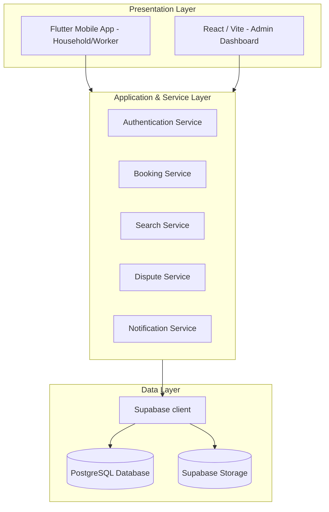

# Software Design Description (SDD) Summary

This document provides a comprehensive summary of the **HomeEase Software Design Description (SDD) Document (Version 1.0)**. It translates the functional requirements defined in the SRS into a concrete technical architecture, database schema, algorithmic workflows, and module traceability matrix.

---

## 1. What's in the SDD Document?

The SDD document defines the technical solution and blueprint for the HomeEase platform. It contains the following core sections:

1. **Introduction & Design Guidelines:** Establishes design principles (modularity, low coupling, high cohesion) and guidelines.
2. **Design Methodology & Process Model:** Outlines the object-oriented design and Agile iteration cycles.
3. **System Overview:** Describes the three-tier system: Flutter client (Household/Worker), React/Vite client (Admin), and Supabase backend (Authentication, PostgreSQL Database, and Storage Buckets).
4. **Design Models:** Includes visual design diagrams (Architecture, Use Case, Process Flows, Class, Sequence, and State transitions).
5. **Data Design:** Provides database tables, data dictionaries, schema types, and constraints.
6. **Algorithms & Implementation:** Outlines pseudo-code and flowcharts for search matching, double-booking prevention, verification, and dispute resolution.
7. **Software Requirements Traceability Matrix (RTM):** Traces every SRS functional requirement back to design modules and schema components.
8. **Human Interface Design:** Maps out screen-to-screen navigation hierarchies for all roles.

---

## 2. Key Architecture & Components

The HomeEase platform utilizes a modern three-tier, service-oriented architecture:

### Module Relations & Layer Responsibilities:
1. **Presentation Layer:** Interfaces with users. The Flutter app manages navigation states (`home_ease_flow.dart`) and binds UI forms to service functions. The Admin Web app operates separate routes for verification and data overview.
2. **Service Layer:** Houses the business logic.
   - `Booking Service` interacts with `Notification Service` and `Dispute Service`.
   - `Search Service` retrieves geographical coordinates to check worker proximity.
3. **Data Layer:** Utilizes Supabase PostgreSQL as the single source of truth. Includes row-level security (RLS) policies to ensure users can only view/modify their own profiles and bookings, except Admins who have broader read/write permissions.

---

## 3. Database Schema & Data Dictionary Summaries

The SDD details 14 database tables:
- **`USERS`**: Master account records. Linked 1-to-1 to profiles.
- **`HOUSEHOLD_PROFILES`** & **`WORKER_PROFILES`**: Contain role-specific metadata (experience, bio, preferences, address).
- **`SERVICE_CATEGORIES`** & **`WORKER_SERVICES`**: Define which service type (cleaning, cooking) a worker provides and their hourly/daily rates.
- **`AVAILABILITY_SLOTS`**: Day-of-week slots for worker availability.
- **`BOOKINGS`**: Transaction records connecting a household, a worker, and a specific service category on a given date/time.
- **`SERVICE_AGREEMENTS`**: Auto-generated text outlining scope and agreed amount for a booking.
- **`PAYMENT_RECORDS`**: Submissions of payment details, including EasyPaisa/JazzCash transaction codes and receipts.
- **`REVIEWS`**: Ratings (1-5 scale) and qualitative feedback given to workers.
- **`VERIFICATION_REQUESTS`**: Worker credential records reviewed by admins.
- **`DISPUTES`**: Claims filed against a transaction (booking/payment).
- **`ISSUE_REPORTS`**: Platform bug or user conduct reports.

---

## 4. Key Algorithmic Workflows

The SDD outlines four major algorithms:

1. **Geographical/Local Search Matching:**
   - Evaluates worker profiles matching a target `ServiceCategory`.
   - Filters profiles matching the household user's `city` and `area`.
   - Sorts results by `average_rating` (descending) and `experience_years` (descending) to ensure quality workers appear first.
2. **Booking Overlap/Double-Booking Prevention:**
   - Before confirming a booking, checks `AVAILABILITY_SLOTS` to verify the worker is active.
   - Checks `BOOKINGS` for any active records where `worker_id = TargetWorker`, `booking_date = RequestedDate`, and the time ranges intersect. If an intersection is found, the request is blocked.
3. **Worker Verification Workflow:**
   - Worker submits details $\rightarrow$ Status changes to `PendingVerification`.
   - Admin approves or rejects. If approved, status updates to `Verified` (unlocking visibility in search). If rejected, the status changes to `RejectedVerification`, allowing resubmission.
4. **Dispute Resolution Flow:**
   - Either user files a dispute $\rightarrow$ State transitions to `OpenDispute`.
   - Admin marks it `InReview`, assesses evidence, and marks it `Resolved` or `RejectedDispute`.
